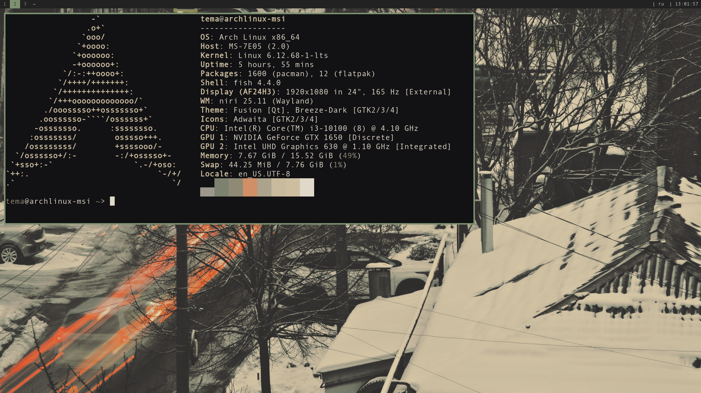

# my rice niri
это мой rice для оконного менеджера [niri](https://github.com/YaLTeR/niri).

## скриншоты

## особенности
*   собранные патчи: нет
*   цветовая схема: `gruvbox`
*   используемые утилиты: [fuzzel](https://codeberg.org/dnkl/fuzzel), [foot](https://codeberg.org/dnkl/foot), [cliphist](https://github.com/sentriz/cliphist), [swww](https://github.com/LGFae/swww), [zellij](https://github.com/zellij-org/zellij), [fish](https://github.com/fish-shell/fish-shell), [gammastep](https://gitlab.com/chinstrap/gammastep)

## зависимости
*   базовые инструменты сборки: `base-devel`, `git`
*   оконный менеджер и утилиты: `fuzzel`, `foot`, `niri`
*   дополнительные программы: `swww`, `flameshot`, `gammastep`, `zellij`, `fish`, `cliphist`

