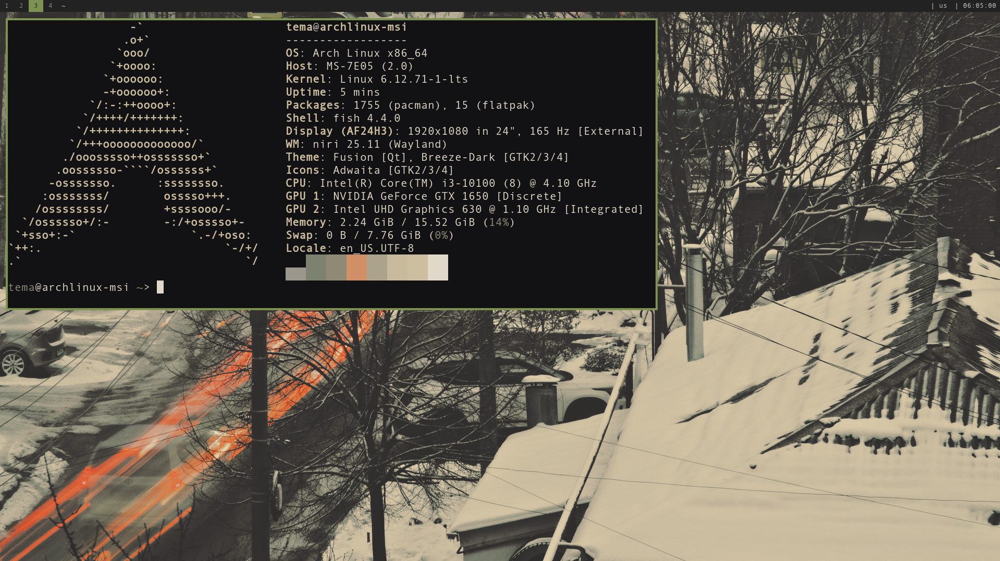
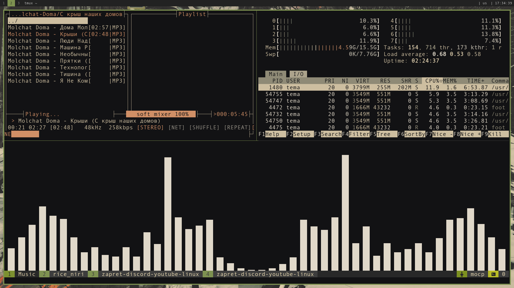
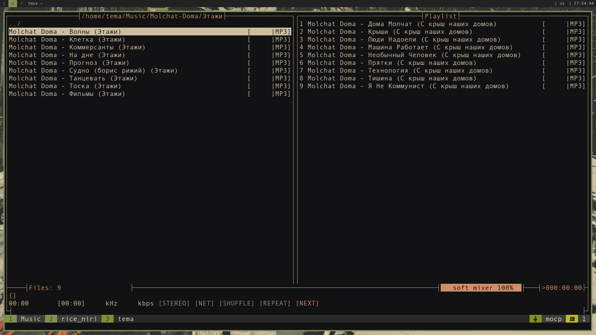
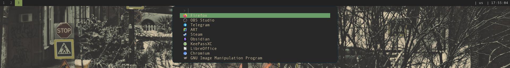
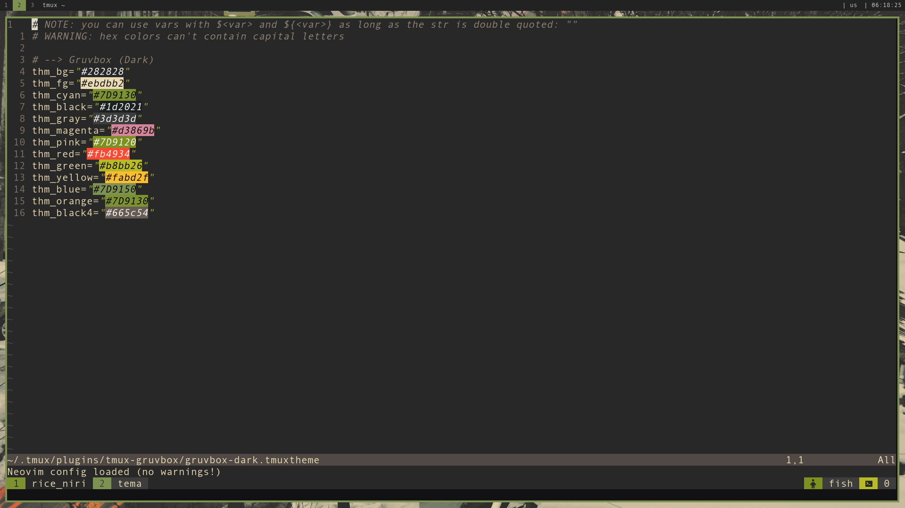

# my rice niri
это мой rice для оконного менеджера [niri](https://github.com/YaLTeR/niri).

## скриншоты

## особенности
*   цветовая схема: `gruvbox`
*   используемые утилиты: 
    [neovim](https://github.com/neovim/neovim),
    [fuzzel](https://codeberg.org/dnkl/fuzzel),
    [foot](https://codeberg.org/dnkl/foot),
    [cliphist](https://github.com/sentriz/cliphist),
    [swww](https://github.com/LGFae/swww),
    [tmux](https://github.com/tmux/tmux),
    [fish](https://github.com/fish-shell/fish-shell),
    [gammastep](https://gitlab.com/chinstrap/gammastep),
    [moc](https://wiki.archlinux.org/title/MOC)

## конфигурация tmux

В этом репозитории лежит мой конфиг **tmux** с [tpm](https://github.com/tmux-plugins/tpm) и [gruvbox](https://github.com/TemaSoul/rice_niri/tree/main/tmux/.tmux/plugins/tmux-gruvbox)

## зависимости
*   базовые инструменты сборки: `base-devel`, `git`
*   дополнительные программы: `swww`, `flameshot`, `gammastep`, `tmux`, `fish`, `cliphist`, `fuzzel`, `foot`, `niri` 

